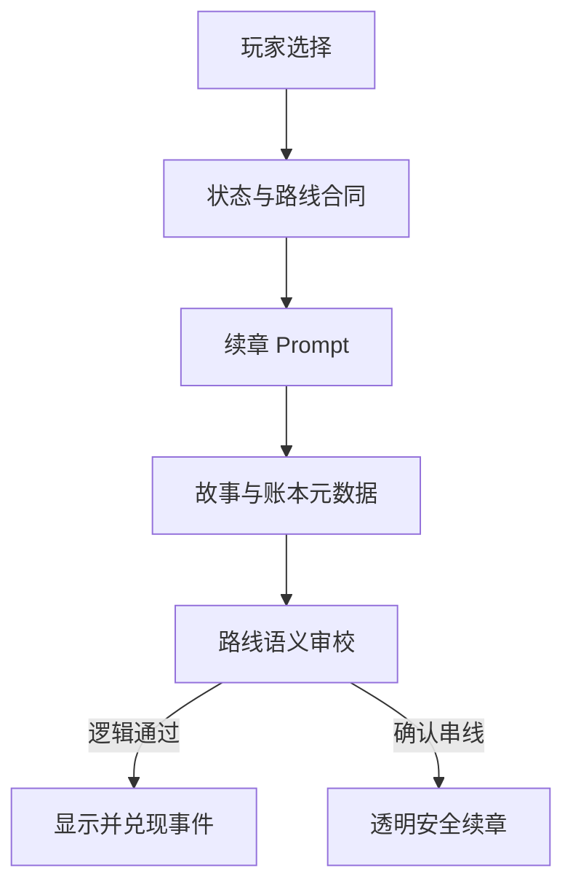

# Story Generation V4：因果状态与生成反馈

## 验收目标

| 目标 | 实现 | 可观察验收 |
|---|---|---|
| 每个选择绑定 2–3 个 story variables | `StoryChoice.effects`，维度为 `career / economy / relationship / selfFulfillment` | 任一 AI 选择的 `effects.length` 为 2–3 |
| 后文沿着已选路线继续 | 服务端从历史选择生成 Route Contract：selected 是已发生事实，unselected 是禁止串入的反事实路线 | 选 A 后不得把 B 的行动或结果写成已经发生 |
| 后果必须真实出现 | 语义审校检查行动、对话、资源与关系变化；callback 只做账本记录，不再用证据原句格式决定整章生死 | 同义改写不会误杀；确认串线、事实矛盾或到期选择完全消失才拦截 |
| 五次选择逐步深入 | 五章依次承担本能冲突、边界表达、代价落地、受挫修正、现实承诺 | 选项有所得也有所失，不重复提问，不设置明显正确答案 |
| 分支缓存不串线 | 章末有选择时，选完才预生成；缓存同时校验 `finalNodeId + stateVersion` | 回溯换选项后不会使用旧分支章节 |
| 用户知道 AI 是否成功 | `/prepare` 显示生成、校验、ready、fallback、failed；fallback 显示原因 | 断开模型后明确显示安全模板，不冒充 AI 结果 |

## 数据流



### Story State

四个维度保存当前已经成立的事实，而非抽象分数：

- `career`：职业路线、岗位、项目或已关闭的机会。
- `economy`：收入、储备、支持安排与风险期限。
- `relationship`：重要关系、承诺、冲突与边界。
- `selfFulfillment`：自主感、价值目标、身心余量与满足方式。

数值型五维 `deltas` 继续用于章末回望；Story State 用于生成事实，两者职责不同。

### Event Ledger

每次选择产生一个事件，记录来源节点、选择、2–3 个 effects、预期后果、最迟兑现章节和状态。续章必须返回：

```json
{
  "callbacks": [
    {
      "eventId": "原始事件 ID",
      "evidence": "从本章正文或选项 outcome 原样复制的证据"
    }
  ]
}
```

callback 是内部记账信息，不再承担故事是否合格的判断。服务端会自动清理重复或未知事件 ID，并把高相似度改写对齐到正文；无法对齐时只丢弃该条元数据，不废掉完整章节。

真正的路线审校读取 Route Contract、Story State 和正文，硬性拦截四类问题：把未选择路线写成已经发生、否定已选事实、与当前状态冲突、无过程地突然反转。到期选择必须通过行动、对话、时间、金钱、资源或关系变化产生后果，单纯复述“人物记得”不算兑现。语义审校自身超时或格式失败时采用 fail-open，不会因为第二次模型调用失败而误杀已经生成的章节。

五章的选择路径固定为：第一章看见本能与核心冲突；第二章练习边界表达；第三章面对真实代价；第四章在受挫后修正；第五章在没有完美答案时做现实承诺。最终章 Coach 基于实际选择总结核心冲突、反复模式、价值排序、可能的盲点和一个可执行的小步骤。

## 生成状态

`/prepare` 只展示系统真实知道的阶段，不模拟百分比：

1. `generating`：请求仍在等待模型返回。
2. `validating`：响应已到达，客户端正在核对并保存结构化结果。
3. `ready`：AI 故事可进入。
4. `fallback`：AI 未配置或没有通过结构/因果检查，已明确切换安全模板。
5. `failed`：请求本身未完成，保留角色卡并提供重试。

所有严格 JSON 生成显式设置 `enable_thinking=false`，避免把请求预算消耗在用户不可见的思考内容上。首章与续章均使用流式响应，避免长文本生成期间上游连接因空闲而中断。首章最多两次 75 秒尝试，输出上限 4500 tokens，只返回五章简要大纲与一个可玩的关键决策场景；后续章节最多三次 90 秒尝试并恢复完整叙事密度。JSON 语法或结构失败后的重试会降低温度并继续保持 JSON 模式。所有调用预算都为 Vercel 响应与安全模板保留余量；最终仍失败时，服务端按当前 Story State、上一选择和待兑现事件构造透明标记的安全续章，玩家不会卡在章末。

## 本地验证

```bash
pnpm lint
pnpm build
```

完整模拟链路：

```bash
node scripts/mock-dashscope.mjs
LLM_BASE_URL=http://127.0.0.1:8787/v1 \
DASHSCOPE_API_KEY=mock pnpm dev
node scripts/e2e-llm.mjs
```

## 失败验收矩阵

| 场景 | 期望结果 |
|---|---|
| 未配置 `DASHSCOPE_API_KEY` | 首章使用安全模板，页面显示 fallback 与原因 |
| 文本模型超时或 JSON 不合法 | 首章和续章都透明降级，不产生 Vercel 504，也不阻断下一章 |
| callback ID 不在账本或重复 | 丢弃错误元数据，完整故事不受影响 |
| callback evidence 是同义改写或无法定位 | 由语义审校从正文提取真实证据；审校不可用时不误杀完整故事 |
| 正文把未选择的 B 路线写成已经发生 | 确认串线后不展示，返回带明确原因的安全续章 |
| 到期选择在正文中完全没有现实后果 | 语义审校确认缺失后不展示，安全续章按账本承接选择 |
| 章末选择前停留 | 不启动下一章预生成 |
| 回溯后选择另一项 | 截断旧的自定义未来章节，重建 state/ledger 后重新生成 |
